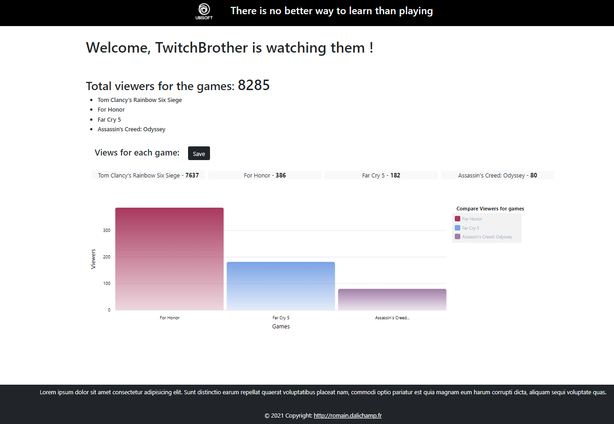
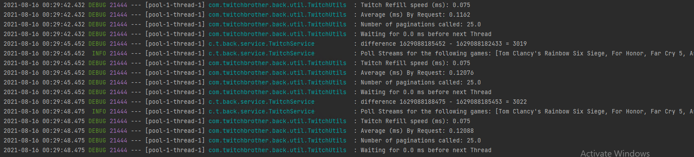

# TwitchBrother

Production URL: https://twitch-brother-lhv7smkqs-fukakai.vercel.app

A page to compare Rainbow Six Siege / Far Cry and Assassin's Creed Odyssey streaming

The number of viewers are updating more or less every 2-4 seconds.

* You need first to download and install the backend application (Java Spring Boot) before to run
  this one.
* Follow the link: https://github.com/fukakai/TwitchBrotherBack

## About

- Production URL: https://twitch-brother.herokuapp.com/
  - not functional yet, the application is fully deployed but heroku is blocking it because of a
    memory leak - it seems it is due to the websocket

## Pre-Installation

Node JS
- download Node.Js https://nodejs.org/en/download/ (version 14.15 ou supérieure)

Python 27
- Open an administrative powershell

Npm
  - make sure npm is installed: `https://docs.npmjs.com/getting-started/`

Windows Build Tools may be required
  - for windows install python with `npm install --global windows-build-tools` from an administrative powershell

## Deploy
- Clone the repository
- run `npm install -g @angular/cli`
- run `npm install`
- `ng serve --configuration development` in local.
- Navigate to `http://localhost:4200/`.

## Frontend

This application is working only with the server (see the server section)

## Server

You can download and install the server here: https://github.com/fukakai/TwitchBrotherBack

